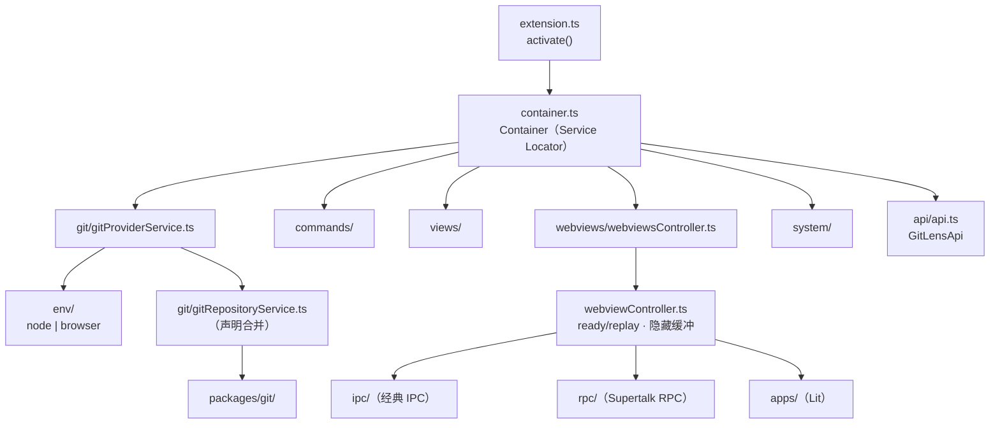

# WeGit 开发指南

本工作区包含 **WeGit** —— 一个强大的 VS Code 扩展，大幅增强 Git 功能。它提供 blame 注释、提交历史可视化、仓库探索以及许多高级 Git 工作流。代码库同时支持桌面版 VS Code（Node.js）和 Web 版 VS Code（browser/webworker）环境。

## 工作风格期望

1. **准确性优先于速度** — 提出变更前先阅读实际代码。不要臆测方法名、装饰器行为或类接口。先通过搜索代码库确认它们确实存在。
2. **简洁性优先于抽象** — 优先选择最简单的正确方案。不要引入新的类型、枚举、标记接口、迁移标志或包装抽象，除非它们服务多个消费者。当用户简化你的方案时，立即采纳。
3. **完整性优先于迭代** — 在把多文件变更视为完成之前，审计所有受影响的位置：调用点、子类覆写、Node.js 和浏览器两条代码路径、以及子 provider。
4. **修复优先于禁用** — 当被要求修复某个功能时，修复根本原因。除非明确要求，否则不要禁用、移除或绕过它。"修复"和"禁用"是不同的指令。
5. **确认优先于假设** — 调试时，先提出带证据的假设再实现。如果请求有歧义，请澄清。对于非平凡的变更，不要不说明方案就默默开始编辑。
6. **有目的的变更** — 鼓励为提升清晰度、可维护性和代码库健康而做的重构与重命名。说明你在改什么以及为什么。不要做与当前任务无关的静默越权改动。
7. **分支归属** — 当前分支承担**所有**问题，而不仅仅是你当前任务引入的。不要在没有对照基础分支验证（`git diff main --stat` 或类似命令）的情况下，就把构建错误、类型错误或测试失败当作"先前已存在"而不予理会。如果某个问题存在于当前分支但不在基础分支上，无论它何时引入，都是该分支的责任。完成当前任务后，处理剩余的分支问题。如果剩余问题范围过大无法处理，请询问用户如何继续。

## 工作中的问题归属

### 分支问题 vs 仓库问题

- **分支问题**：当前分支存在但基础分支不存在的错误。无论由哪个任务或会话引入，都属于当前分支的责任。
- **仓库问题**：基础分支上也存在的错误。这些属于真正先前已存在的问题，可以记录但不需要优先处理。

### 工作流

1. **先聚焦** — 完成当前任务
2. **再修复** — 任务完成后，处理分支上剩余的构建错误、类型错误或测试失败
3. **过大则询问** — 如果剩余问题范围广泛或不清楚，告知用户并询问如何继续，而不是忽略它们

### 完成标准

在以下条件满足前，任务不算完成：

- 代码干净地编译通过（`pnpm run build` 或相关构建命令成功）
- 相关测试通过
- 任何剩余的分支问题已被修复或已向用户提出

## 开发环境

- **Node.js** ≥ 22.12.0，**pnpm** ≥ 10.x（通过 corepack 安装：`corepack enable`），**Corepack** ≥ 0.31.0，**Git** ≥ 2.7.2
- WeGit 支持 **Node.js**（桌面）和 **Web Worker**（browser/vscode.dev）环境 —— 共享代码通过 `src/env/` 中的抽象实现
- 开发时同时测试两种环境

### 性能考量

- 对重量级服务使用懒加载
- 利用缓存层（GitCache、PromiseCache、@memoize）
- 对昂贵的操作进行防抖
- 考虑 webview 刷新性能
- 监控遥测数据中的性能回退

## 开发命令

```bash
pnpm install              # 安装依赖
```

### 构建与开发

```bash
pnpm run rebuild          # 从零完整重建
pnpm run build            # 完整开发构建（包括 e2e 和单元测试的所有内容）
pnpm run bundle           # 生产环境打包
pnpm run bundle:e2e       # E2E 测试的生产环境打包（带 DEBUG 用于账户模拟）
```

### 测试

```bash
pnpm run test             # 运行单元测试（VS Code 扩展测试）
pnpm run test:e2e         # 运行 Playwright E2E 测试
```

> 详细的测试运行模式、输出解读与调试方法：参见 `docs/testing.md`

### 质量

```bash
pnpm run check            # 运行类型检查和 lint 规则（也会作为 `pnpm run build` 的一部分自动运行）
pnpm run check:fix        # 运行类型检查和 lint 规则并自动修复（更好用，无需自行处理可自动修复的问题）
pnpm run pretty           # 使用 Prettier 格式化代码
pnpm run pretty:check     # 检查格式
```

### 专用命令（常规开发通常不需要，它们已包含在 build/watch 中）

```bash
pnpm run generate:contributions  # 根据 contributions.json 生成 package.json contributions
pnpm run extract:contributions   # 从 package.json 提取 contributions 到 contributions.json
pnpm run generate:commandTypes   # 根据 contributions 生成命令类型
pnpm run build:icons             # 从 SVG 源文件构建图标字体
```

## Git 与仓库指南

CHANGELOG 格式与条目指南，使用 `/audit-commits`。代码审查，使用 `/review` 或 `/deep-review`。调试方法论与常见误诊模式，使用 `/investigate`。

### 分支指南

- 从 `main` 或其他功能分支拉取功能分支（若需堆叠）
- 使用合适的类型前缀：`feature/`、`bug/`、`debt/`
- 使用描述性名称：`feature/search-natural-language`、`bug/graph-performance`
- 如有相关 issue，在分支名中引用：`feature/#1234-search-natural-language`

## 高层架构

### 目录结构

```
src/
├── extension.ts              # 扩展入口点，激活逻辑
├── container.ts              # Service Locator —— 管理所有服务（单例）
├── @types/                   # TypeScript 类型定义
├── annotations/              # 编辑器装饰 provider（blame/changes/heatmap）
├── api/                      # Action runners API 表面
├── autolinks/                # 在提交消息和分支名中自动链接 issues/PRs
├── commands/                 # 命令实现（64 个顶层文件 + 子目录）
│   ├── git/                  # Git 子命令
│   ├── ghpr/                 # GitHub PR 相关命令
│   ├── quick-wizard/         # 快速向导命令
│   ├── signing/              # 提交签名命令
│   └── *.ts                  # 单个命令文件
├── env/                             # 环境特定的实现
│   ├── node/                        # Node.js（桌面）实现
│   │   └── git/
│   │       ├── cliGitProvider.ts    # CLI Git provider（child_process）—— 合并的单一文件
│   │       ├── squashEditor.ts      # Squash 提交编辑器辅助
│   │       └── vslsGitProvider.ts    # Live Share Git provider
│   └── browser/              # 浏览器/webworker 实现
├── git/                      # Git 抽象层
│   ├── gitProvider.ts        # Git provider 接口
│   ├── gitProviderService.ts # 管理多个 Git provider
│   ├── models/               # Git 模型类型（Branch、Commit 等）
│   ├── formatters/           # 提交消息/补丁格式化
│   ├── integrations/         # Git 托管与 issue tracker 集成（GitHub、GitLab、Jira 等）
│   ├── remotes/              # 远程 provider 与集成管理
│   └── actions/              # 更高级的 Git 工作流操作
├── onboarding/               # 可关闭的 UI / 引导状态 provider
├── quickpicks/               # Quick pick/input（快速菜单）实现
├── statusbar/                # 状态栏项管理
├── system/                   # 工具库
│   ├── utils/                # 在 host 和 webviews 中都可用的工具
│   └── utils/-webview/       # 仅扩展宿主使用的工具
├── telemetry/                # 使用分析与错误上报
├── terminal/                 # 终端集成 provider
├── trackers/                 # 跟踪文档状态与 blames
├── uris/                     # 深链接 uri 处理
├── views/                    # 树视图 provider（侧边栏视图）
│   ├── nodes/                # 树节点实现（分支/提交/文件历史等）
│   ├── abstract/             # 视图节点的抽象基类
│   └── *.ts                  # 单个视图文件（commitsView、branchesView 等）
├── virtual/                  # 虚拟文件系统 provider
├── vsls/                     # Live Share 支持
└── webviews/                 # Webview 实现
    ├── apps/                 # Webview UI 应用（仅 Lit）
    │   ├── shared/           # 使用 Lit 的通用 UI 组件
    │   ├── commitDetails/
    │   ├── media/
    │   ├── rebase/
    │   └── settings/
    ├── protocol.ts           # webview 通信的 IPC 协议
    └── webviewController.ts  # 所有 webview 的基类控制器
tests/                        # E2E 与单元测试
custom-elements.json          # Custom Elements Manifest —— 生成的 web 组件元数据
```

> 详细架构（模式、服务、环境抽象、webviews、构建配置）：参见 `docs/architecture.md`

## 编码标准与风格规则

- **严格 TypeScript** — 不允许使用 `any`（外部 API 除外）
- 公共方法**显式返回类型**；联合类型**优先 `type` 而非 `interface`**
- **使用路径别名**：`@env/` 用于环境特定代码
- **导入顺序**：node 内置 → 外部 → 内部 → 相对
- **不使用默认导出**；纯类型导入使用 `import type`
- 导入中**始终使用 `.js` 扩展名**（ESM 要求）
- **命名**：类 PascalCase（无 `I` 前缀），方法/变量 camelCase，常量 camelCase（非 SCREAMING_SNAKE_CASE），文件 camelCase.ts
- **文件夹**：模型放 `models/`，工具放 `utils/`（host + webview 两者），仅宿主专用放 `utils/-webview/`，webview 应用放 `webviews/apps/`

> 错误处理模式、实现质量规则与完整性清单：参见 `docs/coding-standards.md`
>
> webview 无障碍要求：参见 `docs/accessibility.md`

### 装饰器系统

代码库使用方法装饰器（`src/system/decorators/`），它们显著改变运行时行为：

| 装饰器                              | 用途                               | 关键陷阱                                                          |
| ----------------------------------- | ---------------------------------- | ----------------------------------------------------------------- |
| `@info()` / `@debug()` / `@trace()` | 带作用域跟踪的日志                 | `getScopedLogger()` 必须在任何 `await` **之前**调用（浏览器限制） |
| `@gate()`                           | 并发调用去重（返回同一个 promise） | 5 分钟超时；方法挂起最常见的原因                                  |
| `@memoize()`                        | 在实例上永久缓存返回值             | 连被拒绝的 Promise 也会缓存；使用 `invalidateMemoized()` 清除     |
| `@sequentialize()`                  | 排队调用，一次执行一个             | 与 `@gate()` 不同 —— 排队而不是去重                               |
| `@debounce()`                       | 按实例对方法调用防抖               |                                                                   |
| `@command()`                        | 注册 VS Code 命令类                | 类装饰器，而非方法装饰器                                          |

装饰器堆叠自底向上执行（最外层先运行）。调试时：先检查 `@gate()` 是否挂起，再检查 `@memoize()` 是否有过期数据，最后再检查日志装饰器。

详细的装饰器行为与调查方法论，使用 `/investigate`。

## 快速查找

常见任务的参考示例与关键规则。

### 可用技能

技能为常见任务提供详细的分步工作流。使用 `/{skill-name}` 调用。

| Skill              | 用途                                                       |
| ------------------ | ---------------------------------------------------------- |
| `/triage`          | 对 GitHub issues 进行分流 —— 判定、置信度、建议操作        |
| `/investigate`     | 带根因分析的结构化缺陷调查                                 |
| `/prioritize`      | 对已分流 issues 排序 —— 候选清单、积压、不修复、社区       |
| `/update-issues`   | 根据分流/调查/排序报告更新 GitHub issues                   |
| `/dev-scope`       | 将工作范围定义为目标文档 —— 定义做什么和为什么，而非怎么做 |
| `/deep-planning`   | 设计实现方案 —— 调查代码库，给出权衡取舍                   |
| `/challenge-plan`  | 压力测试拟议的方案或架构决策                               |
| `/analyze`         | 深入的设计/实现分析，魔鬼代言人                            |
| `/review`          | 对照标准进行代码审查 + 影响完整性审计                      |
| `/deep-review`     | 深度合并阻断审查 —— 追踪代码路径以验证正确性               |
| `/ux-review`       | UX 审查 —— 对照目标文档追踪用户流程                        |
| `/a11y-audit`      | 审计组件/文件/目录的 WCAG 2.1 AA 无障碍性                  |
| `/a11y-flow-audit` | 审计页面或流程的 WCAG 2.1 AA 组合级合规性                  |
| `/a11y-remediate`  | 将 /a11y-audit 结果转化为面向决策者的补救提案              |
| `/modern-css`      | CSS 编写/审查指南 —— 现代模式、tokens、shadow DOM 安全     |
| `/create-issue`    | 根据代码变更创建 GitHub issues                             |
| `/audit-commits`   | 审计提交范围，检查 issues 与 CHANGELOG 条目                |
| `/worktree`        | 为功能开发创建隔离的 git worktrees                         |
| `/add-command`     | 搭建一个新的 VS Code 命令                                  |
| `/add-webview`     | 搭建新的 webview，包含 IPC、Lit 应用、注册                 |
| `/add-test`        | 生成单元或 E2E 测试文件                                    |
| `/add-icon`        | 向 GL Icons 字体添加图标                                   |
| `/add-ai-provider` | 添加新的 AI provider 集成                                  |
| `/live-inspect`    | 通过 Playwright 启动带 WeGit 的 VS Code，检查 UI/日志      |
| `/live-exercise`   | 面向 UI 工作的实时操作 + 审计 + 修复循环                   |
| `/live-perf`       | 带三级纪律的实时性能测量与改进                             |
| `/live-pair`       | 与实时实例进行交互式结对编程（用户驱动的反馈）             |

### 典型示例

实现新内容时，先看这些文件：

| 任务                | 示例文件                                       |
| ------------------- | ---------------------------------------------- |
| 简单命令            | `src/commands/copyCurrentBranch.ts`            |
| 复杂命令（多命令）  | `src/commands/gitWizard.ts`                    |
| IPC 协议            | `src/webviews/rebase/protocol.ts`              |
| Webview provider    | `src/webviews/rebase/rebaseWebviewProvider.ts` |
| Webview 应用（Lit） | `src/webviews/apps/rebase/`                    |
| 单元测试            | `src/autolinks/__tests__/autolinks.test.ts`    |
| E2E 测试            | `tests/e2e/specs/smoke.test.ts`                |
| E2E 页面对象        | `tests/e2e/pageObjects/gitLensPage.ts`         |

### 关键规则

**contributions.json**（仅适用于 `contributes/commands`、`contributes/menus`、`contributes/submenus`、`contributes/keybindings` 和 `contributes/views`）

- 绝不在 `package.json` 中直接编辑这些部分 —— 请编辑 `contributions.json`
- 编辑后运行 `pnpm run generate:contributions`（或让 watcher 处理）
- 添加命令后运行 `pnpm run generate:commandTypes`（或让 watcher 处理）

**导入**

- 导入中始终使用 `.js` 扩展名（ESM 要求）
- 仅使用命名导出（无 `default` 导出）

**IPC**

- `IpcCommand` = 即发即弃（无响应）
- `IpcRequest` = 期望响应（使用 `await`）
- `IpcNotification` = 扩展 → webview 状态更新

**测试**

- 调试测试失败时，不要为了通过测试而简化或改变测试意图。相反，调查并理解失败的根因并直接处理它，如果无法解决则向用户提出。

## 项目愿景

**WeGit**（包名 `wegit`，v18.2.0，publisher `liao666brant`）—— 小而美的 Git 工具：在 VS Code 中提供 blame 注释、提交历史可视化、仓库探索与常用 Git 工作流，同时支持桌面版 VS Code（Node.js）与 Web 版 VS Code（browser/webworker）。产品定位与能力概述见文首简介；详细架构见 [docs/architecture.md](docs/architecture.md)。

## 架构总览

### 激活链路

```
extension.activate()（src/extension.ts）
  → Logger.configure + 预发布过期检查
  → Container.create()（src/container.ts，Service Locator 单例）
  → once(container.onReady)：registerCommands()（src/commands.ts 副作用注册）+ 注册 Action Runner
  → await container.ready()（注册 Git providers）
  → return new Api(container)（GitLensApi）
```

- 服务装配集中在 `Container` 构造函数：`GitProviderService`（git）、`Views`、`WebviewsController`、`GitDocumentTracker`/`LineTracker`、`StatusBarController`、`TelemetryService` 等全部单例在此创建、订阅与释放。
- **环境双路径**：`@env/*` 别名按构建目标解析（`tsconfig.node.json` → `src/env/node/`，`tsconfig.browser.json` → `src/env/browser/`），两套实现签名一致；浏览器端 git 为降级 stub（`git()` 返回空 stdout，`getSupportedGitProviders()` 返回空数组）。
- **分层**：`src/git` 是 `packages/git` 的宿主桥接层（SCM 集成、仓库发现、`GitRepositoryService` 声明合并）；webviews 通过**经典 IPC + Supertalk RPC** 与宿主通信；Lit 应用仅存在于 `webviews/apps/`。

### 结构图



## 模块索引

各模块文档（`AGENTS.md` 为索引产物，事实以代码为准）：

| 模块                                            | 文档                         | 职责                                                                                |
| ----------------------------------------------- | ---------------------------- | ----------------------------------------------------------------------------------- |
| [src/](src/AGENTS.md)                           | `src/AGENTS.md`              | 扩展宿主全部源码：入口、服务装配、Git 桥接、命令、视图、工具库、webviews            |
| [src/env/](src/env/AGENTS.md)                   | `src/env/AGENTS.md`          | 环境抽象：node 与 browser 双实现（`@env/*`），browser git 为降级 stub               |
| [src/git/](src/git/AGENTS.md)                   | `src/git/AGENTS.md`          | `packages/git` 的宿主桥接：provider 管理、仓库模型、GitUri、声明合并                |
| [src/commands/](src/commands/AGENTS.md)         | `src/commands/AGENTS.md`     | 命令实现与注册（id 源：`contributions.json` + generated constants）                 |
| [src/views/](src/views/AGENTS.md)               | `src/views/AGENTS.md`        | 侧边栏树视图与视图节点（refresh/reveal 防抖）                                       |
| [src/system/](src/system/AGENTS.md)             | `src/system/AGENTS.md`       | 工具库：`utils/`（共享）、`utils/-webview/`（仅宿主）、`decorators/`、`rpc/`        |
| [src/webviews/](src/webviews/AGENTS.md)         | `src/webviews/AGENTS.md`     | webview 宿主控制器、经典 IPC、Supertalk RPC、Lit apps                               |
| [packages/utils/](packages/utils/AGENTS.md)     | `packages/utils/AGENTS.md`   | `@gitlens/utils`：宿主与 webview 共享工具（debounce、装饰器、iterable、logger 等）  |
| [packages/ipc/](packages/ipc/AGENTS.md)         | `packages/ipc/AGENTS.md`     | `@gitlens/ipc`：IPC 消息模型与传输                                                  |
| [packages/git/](packages/git/AGENTS.md)         | `packages/git/AGENTS.md`     | `@gitlens/git`：Git 抽象层（模型、sub-providers、缓存、watch 服务）                 |
| [packages/git-cli/](packages/git-cli/AGENTS.md) | `packages/git-cli/AGENTS.md` | `@gitlens/git-cli`：git 可执行文件定位与 CLI 执行                                   |
| [packages/core/](packages/core/AGENTS.md)       | `packages/core/AGENTS.md`    | `@liao666brant/core-wegit`：核心库打包产物（`pnpm run build:core`）                 |
| [scripts/](scripts/AGENTS.md)                   | `scripts/AGENTS.md`          | 构建、贡献物生成、命令类型生成等脚本（`build.mjs`、`generateContributions.mts` 等） |
| [tests/e2e/](tests/e2e/AGENTS.md)               | `tests/e2e/AGENTS.md`        | Playwright E2E：`fixtures/`、`pageObjects/`、`specs/`                               |

## 运行与开发

- 环境要求与性能考量见上「开发环境」；命令速查见上「开发命令」与「专用命令」。
- 典型工作流：`pnpm install` → `pnpm run watch`（增量构建）→ 在 VS Code 扩展开发宿主中启动（见 `.vscode/launch.json`）。
- 双环境编译：`tsconfig.node.json` / `tsconfig.browser.json` 分别覆盖桌面与 Web 目标；`src/webviews/apps/**` 与对方环境的 `src/env/**` 被排除，apps 由 webpack 单独打包。
- 改动命令相关：见上「关键规则 → contributions.json」；改后运行 `pnpm run generate:contributions` 与 `pnpm run generate:commandTypes`。

## 测试策略

- **单元测试**：与源码同目录 `__tests__/*.test.ts`（`@vscode/test-cli`），`pnpm run test`；包级测试 `pnpm run test:packages`。已有：`src/commands/__tests__`、`src/git/__tests__`、`src/system/__tests__` 等。
- **E2E**：Playwright，`tests/e2e/`（fixtures / pageObjects / specs），`pnpm run test:e2e`（需先 `pnpm run bundle:e2e` 或 watch）。
- 运行模式、输出解读与调试方法：见 [docs/testing.md](docs/testing.md)；失败处理原则见上「关键规则 → 测试」。

## 编码规范

规范主体见上「编码标准与风格规则」「装饰器系统」「关键规则」；错误处理模式与实现质量规则见 [docs/coding-standards.md](docs/coding-standards.md)。要点：严格 TypeScript（禁 `any`，外部 API 除外）、导入恒带 `.js` 扩展名（ESM）、禁止 default 导出、纯类型导入用 `import type`、联合类型优先 `type`、`@env/` 路径别名。

## AI 使用指引

1. **先读再改**：改动前先读对应模块的 `AGENTS.md`（见「模块索引」）与相关源码，不臆测方法名、装饰器行为或类接口。
2. **双路径意识**：涉及共享代码的改动须同时考虑 Node 与 browser 两条路径；webview 改动保持键盘可操作与无障碍（[docs/accessibility.md](docs/accessibility.md)）。
3. **命令 id**：以 `contributions.json` + `src/constants.commands.generated.ts` 为准，勿手写字符串字面量；生成流程见「专用命令」。
4. **技能**：常见任务先用上「可用技能」表中的 `/` 技能；提交遵循仓库 Git 指南。
5. **文档定位**：本文件为人工维护的开发规范；模块 `AGENTS.md` 为初次索引产物，与代码不一致时以代码为准并更新文档。

## 精简变更记录

- 2026-08-15：初次索引完成。新增 `src/`、其六个子模块、五个 workspace package、`scripts/` 与 `tests/e2e/` 的 `AGENTS.md`/`CLAUDE.md`；根文档补足项目愿景、架构总览、结构图、模块索引与索引状态（基线 `0be2fef52`）。既有正文（工作风格、开发命令、编码规范等）逐字保留。

## 索引状态

- 上次索引：2026-08-15T15:19:21Z（@0be2fef52）
- 基线提交：0be2fef52e77c7a1452c0854d05ea8fb238cfebc
- 已知缺口：无
- 扫描进度：已完成
